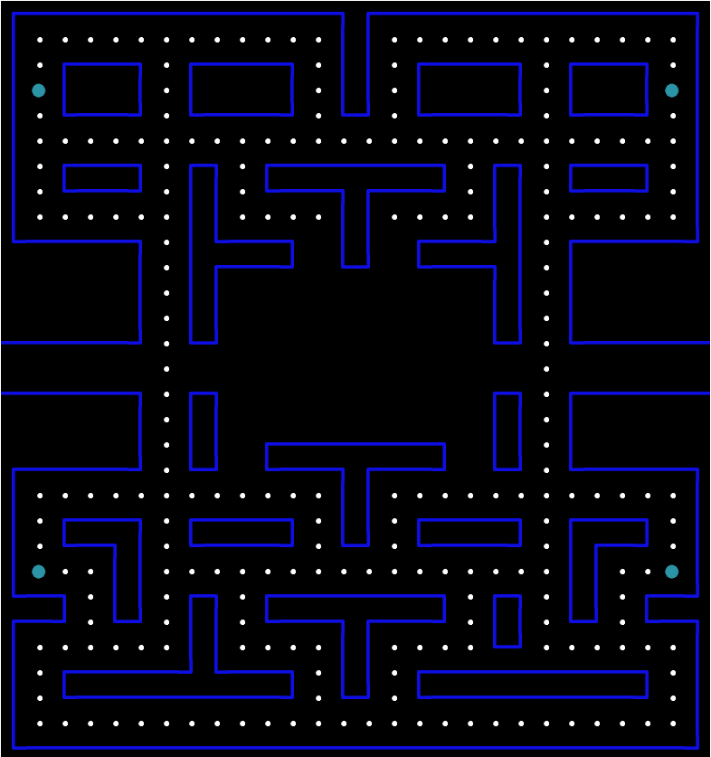

# TwentyEight

Manupulating the DOM via rust, has proformance issues.

This is a just a performance testbed. A simple game
where I explore the performance differences between code
patterns that change the DOM at speed.

The keyboard event listener manipulates the DIV under consideration as the char moves .. this should be a performant as possibile.

