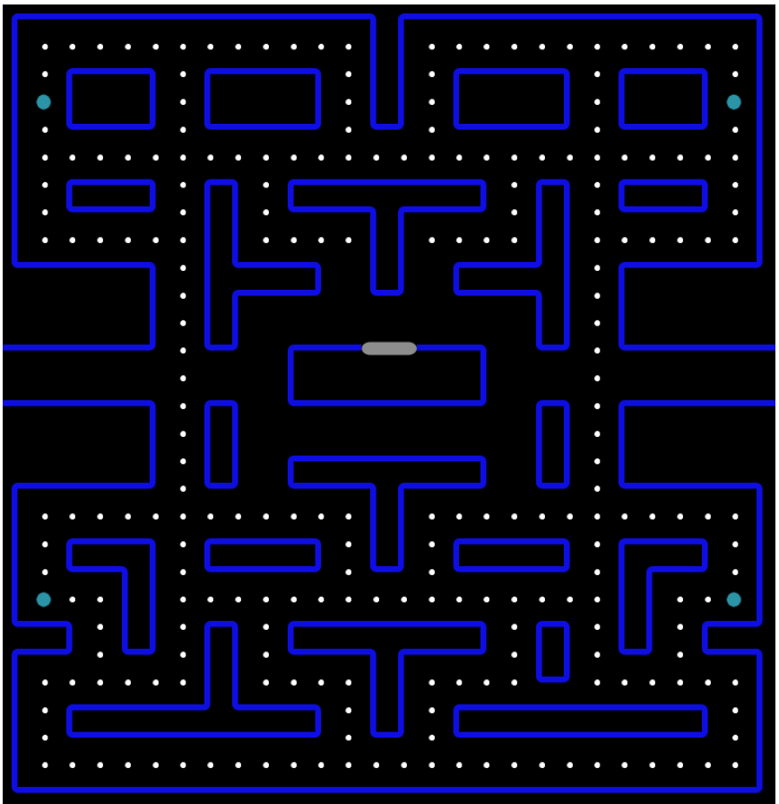

# TwentyEight

Manupulating the DOM via rust, has preformance issues.

This is a just a testbed. A simple game
where I explore the performance differences between code
snippets built to change the DOM at speed.

The keyboard event listener manipulates the DIV under consideration as the char moves .. this should be a performant as possibile.



# Building the project

First install [trunk](https://crates.io/crates/trunk)

then run

```bash
 trunk serve
```

"Trunk is a WASM web application bundler for Rust."

[ I was using web_pack with a CopyWebpackPlugin but that pipeline is unstable. ]

The configuration is in "Trunk.toml" with assets directories specified in index.html
